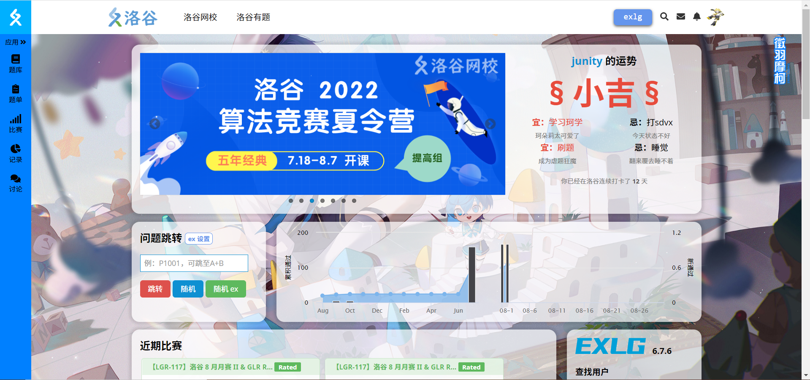
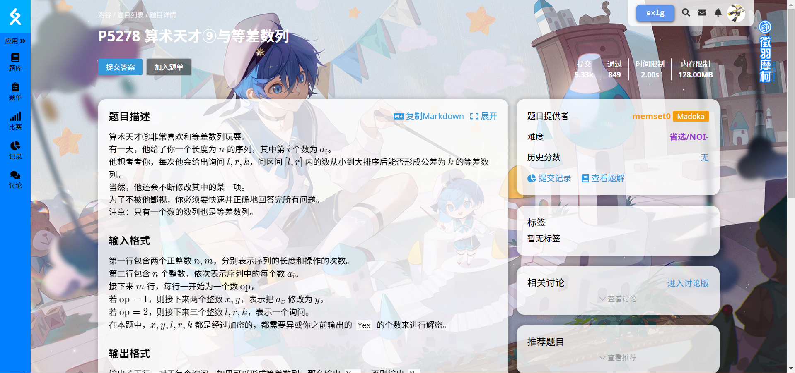
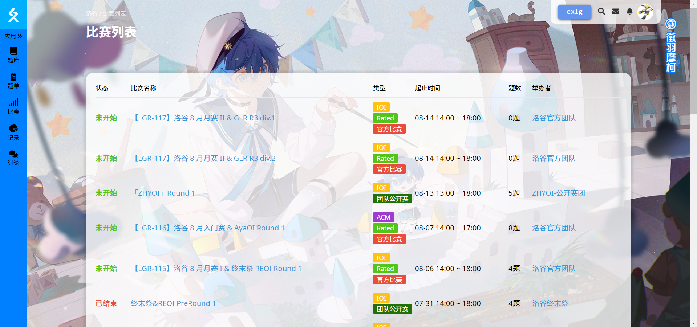

# luogu-beautify
美化洛谷

## Features
 - 全页面背景图片
 - 半透明卡片
 - 圆角

## 使用方法
先下个可以添加自制css的插件，比如 [User JavaScript and CSS](https://chrome.google.com/webstore/detail/nbhcbdghjpllgmfilhnhkllmkecfmpld)
然后把 [luogu.css](luogu.css) 应用上去就可以了

## 屏幕截图

